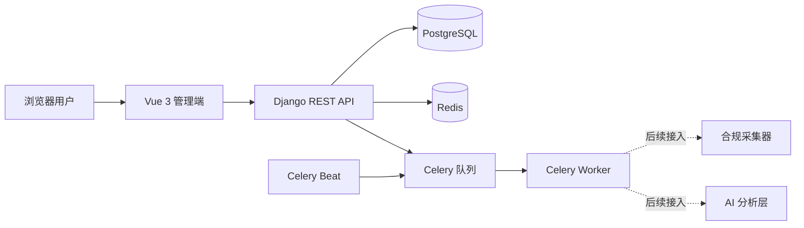

# Phone Voice Insight

手机用户口碑洞察平台（Phone Voice Insight，PVI）用于整合手机产品在公开渠道中的真实用户反馈。首个目标产品是荣耀 Power2，首批来源为京东自营商品评价与荣耀俱乐部帖子/回复。

## 第一版范围

Phase 1 只交付可运行的 Monorepo 基础框架：Django REST API、Vue 后台、PostgreSQL、Redis、Celery、基础模型、管理后台、采集与 AI 契约、测试、Docker Compose、CI 和开发文档。

当前明确不包含真实网站采集、登录/验证码或反爬处理、AI 模型调用、Embedding/聚类、RAG、正式评分、付费权限和 Kubernetes。未实现采集器会明确失败，不生成虚假反馈或分析结果。

## 技术栈

- 后端：Python 3.12+、Django 5.2、Django REST Framework、PostgreSQL、Redis、Celery、django-filter、drf-spectacular、pytest、Ruff、mypy
- 前端：Vue 3、TypeScript、Vite、Vue Router、Pinia、Element Plus、Axios、ECharts、Vitest、ESLint、Prettier
- 工程：Docker Compose、Nginx 配置预留、GitHub Actions、PowerShell/Shell/Makefile

Python 依赖锁定在 `backend/uv.lock`，Node 依赖锁定在 `frontend/package-lock.json`。

## 系统架构



详细边界与数据流见 [架构文档](docs/architecture.md)。

## 目录结构

```text
phone-voice-insight/
├── backend/                 # Django、DRF、Celery、模型、API 和测试
├── frontend/                # Vue 3 管理端和测试
├── collectors/              # 采集器契约及未实现来源骨架
├── ai/                      # Schema、示例和版本化 Prompt
├── docs/                    # 需求、架构、契约、开发与部署文档
├── deploy/                  # Dockerfile 和 Nginx 预留配置
├── scripts/                 # PowerShell 与 Shell 开发入口
├── .github/workflows/       # CI
├── docker-compose.yml
├── docker-compose.dev.yml
├── docker-compose.prod.yml
└── Makefile
```

## 快速启动

需要 Python 3.12+、Node.js 20.19+、`uv`，完整环境还需要 Docker Desktop/Engine。

Windows PowerShell：

```powershell
.\scripts\setup.ps1
.\scripts\dev.ps1
```

Linux/macOS：

```bash
sh scripts/setup.sh
sh scripts/dev.sh
```

首次执行 `setup` 会从 `.env.example` 创建未提交的 `.env`。正式或共享环境必须替换示例密钥和数据库密码。

## 本地开发

若 PostgreSQL 与 Redis 已在本机运行，推荐使用带依赖预检的脚本启动后端：

```powershell
.\scripts\backend.ps1
```

脚本会在 PostgreSQL 未启动时立即给出提示，不再等待 Django 连接超时。没有 Docker/PostgreSQL、只想联调前端时，可显式使用本地预览模式：

```powershell
.\scripts\backend.ps1 -UseSQLite
```

SQLite 模式只用于 UI 联调和快速体验；正常开发、CI 集成测试和部署仍以 PostgreSQL 为准。未启动 Redis 时 API 可以工作，但健康检查会如实返回 `redis=error`，Celery Worker 不可用。

```powershell
cd frontend
npm ci
$env:VITE_API_BASE_URL = "http://localhost:8000/api/v1"
npm run dev
```

Celery 可在另一个终端运行：

```powershell
cd backend
uv run celery -A config worker --loglevel=INFO
```

更多 Windows、Linux/macOS 和常见问题见 [开发指南](docs/development.md)。

## Docker 启动

标准启动：

```powershell
Copy-Item .env.example .env
docker compose up --build
```

带源代码挂载与热更新：

```powershell
docker compose -f docker-compose.yml -f docker-compose.dev.yml up --build
```

停止服务：

```powershell
docker compose down
```

PostgreSQL 与 Redis 使用命名卷持久化。端口冲突时修改 `.env` 中的 `BACKEND_PORT`、`FRONTEND_PORT`、`POSTGRES_HOST_PORT` 或 `REDIS_HOST_PORT`。

生产环境使用静态前端、Nginx 和 Gunicorn：

```bash
cp .env.example .env
# 设置随机 SECRET_KEY、POSTGRES_PASSWORD 和实际公开地址
docker compose --env-file .env -f docker-compose.prod.yml up -d --build
```

服务器部署细节、公开入口和运维 aliases 见 [部署说明](docs/deployment.md)。

## 测试与质量检查

```powershell
.\scripts\test.ps1
.\scripts\lint.ps1
```

或分别执行：

```powershell
cd backend
uv run ruff format --check . ..\collectors ..\ai
uv run ruff check . ..\collectors ..\ai
uv run mypy .
uv run pytest

cd ..\frontend
npm run lint
npm run typecheck
npm run test
npm run build
```

测试不会连接京东、荣耀俱乐部或任何真实 AI 服务。后端测试使用 SQLite 并 mock Redis 健康检查；开发和部署配置仍使用 PostgreSQL/Redis。

## 访问地址

使用默认端口时：

- 前端：<http://localhost:5173>
- API：<http://localhost:8000/api/v1/>
- 健康检查：<http://localhost:8000/api/v1/health/>
- OpenAPI Schema：<http://localhost:8000/api/schema/>
- Swagger UI：<http://localhost:8000/api/docs/>
- ReDoc：<http://localhost:8000/api/redoc/>
- Django Admin：<http://localhost:8000/admin/>

管理员账号可用 `make createsuperuser` 或 `uv run python manage.py createsuperuser` 创建。

## 当前完成情况

- 已建立产品、来源、采集任务、统一反馈、分析结果和报告快照模型及迁移。
- 初始化数据包含荣耀、荣耀 Power2、5 个产品别名、2 个内存/存储版本、京东与荣耀俱乐部；不含虚假反馈和 AI 结果。
- 已提供要求的只读 API、采集任务创建 API、分页/筛选、健康检查、OpenAPI、Swagger/ReDoc 和 Admin。
- 已提供 Celery `system_ping` 与明确失败的 `run_collection_task`。
- Vue 管理端包含总览、产品、采集任务、原始反馈、AI 空状态和系统状态页面。
- 采集器和 AI 层只有可验证契约，不访问外部服务。

## 后续路线

下一阶段为“荣耀俱乐部采集 PoC”，先确认合规边界，再做低频公开内容采集、分页/checkpoint 与契约测试。完整阶段见 [路线图](docs/roadmap.md)。

## 数据合规

项目只处理合法、公开且符合平台规则的数据。禁止破解验证码、绕过登录/权限、盗取 Cookie、共享未授权账号、使用代理池规避限制或进行攻击式高频访问。采集需限速、可追踪、最小化保存；原始数据受控保留，展示与分析前应对个人标识和敏感内容脱敏。详见 [采集契约](docs/crawler-contract.md) 与 [数据契约](docs/data-contract.md)。
