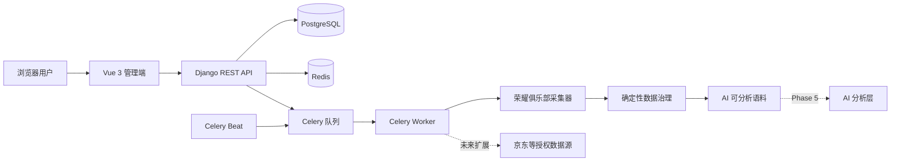

# Phone Voice Insight

> 路线状态：Phase 1/2/4 COMPLETED，Phase 3 POSTPONED，Phase 5 AI 结构化分析 IN PROGRESS。Phase 5 已实现 provider-neutral 调用、严格 Schema/证据校验、批次与人工评估、管理命令和前端页面；真实 AI PoC 必须等待生产配置完成后按 20 → 100 → 剩余语料的闸门执行，当前不得进入 Phase 6。

Phase 5 的配置、命令和执行闸门见 [AI 结构化分析](docs/ai-analysis-phase5.md)，固定 15 个维度见 [AI 分类体系](docs/ai-taxonomy.md)，人工抽检方法见 [AI 评估](docs/ai-evaluation.md)。

手机用户口碑洞察平台（Phone Voice Insight，PVI）用于整合手机产品在公开渠道中的真实用户反馈。第一版聚焦荣耀 Power2，正式数据只依赖荣耀俱乐部公开帖子与回复；系统保留未来扩展京东及其他公开或授权数据源的能力。

## 当前范围

Phase 1 已交付可运行的 Monorepo 基础框架。Phase 2 已完成荣耀俱乐部公开页面的低频采集 PoC 和 2 页/20 帖门禁。Phase 3 京东评价采集因外部访问限制正式标记为 **POSTPONED**：已有失败关闭框架和探测能力会保留，但第一版不再依赖京东数据。Phase 4 已完成荣耀俱乐部数据治理、10 页安全扩容和真实增量边界验收。

当前不包含登录/验证码或反爬绕过、AI 模型调用、Embedding/聚类、RAG、正式评分、付费权限和 Kubernetes。未现场验证的京东 endpoint 会明确失败，不生成虚假反馈或分析结果。

## 技术栈

- 后端：Python 3.12+、Django 5.2、Django REST Framework、PostgreSQL、Redis、Celery、django-filter、drf-spectacular、pytest、Ruff、mypy
- 前端：Vue 3、TypeScript、Vite、Vue Router、Pinia、Element Plus、Axios、ECharts、Vitest、ESLint、Prettier
- 工程：Docker Compose、Nginx 配置预留、GitHub Actions、PowerShell/Shell/Makefile

Python 依赖锁定在 `backend/uv.lock`，Node 依赖锁定在 `frontend/package-lock.json`。

## 系统架构



详细边界与数据流见 [架构文档](docs/architecture.md)。

## 目录结构

```text
phone-voice-insight/
├── backend/                 # Django、DRF、Celery、模型、API 和测试
├── frontend/                # Vue 3 管理端和测试
├── collectors/              # 采集器契约、荣耀俱乐部实现及其他来源骨架
├── ai/                      # Schema、示例和版本化 Prompt
├── docs/                    # 需求、架构、契约、开发与部署文档
├── deploy/                  # Dockerfile 和 Nginx 预留配置
├── scripts/                 # PowerShell 与 Shell 开发入口
├── .github/workflows/       # CI
├── docker-compose.yml
├── docker-compose.dev.yml
├── docker-compose.prod.yml
└── Makefile
```

## 快速启动

需要 Python 3.12+、Node.js 20.19+、`uv`，完整环境还需要 Docker Desktop/Engine。

Windows PowerShell：

```powershell
.\scripts\setup.ps1
.\scripts\dev.ps1
```

Linux/macOS：

```bash
sh scripts/setup.sh
sh scripts/dev.sh
```

首次执行 `setup` 会从 `.env.example` 创建未提交的 `.env`。正式或共享环境必须替换示例密钥和数据库密码。

## 本地开发

若 PostgreSQL 与 Redis 已在本机运行，推荐使用带依赖预检的脚本启动后端：

```powershell
.\scripts\backend.ps1
```

脚本会在 PostgreSQL 未启动时立即给出提示，不再等待 Django 连接超时。没有 Docker/PostgreSQL、只想联调前端时，可显式使用本地预览模式：

```powershell
.\scripts\backend.ps1 -UseSQLite
```

SQLite 模式只用于 UI 联调和快速体验；正常开发、CI 集成测试和部署仍以 PostgreSQL 为准。未启动 Redis 时 API 可以工作，但健康检查会如实返回 `redis=error`，Celery Worker 不可用。

```powershell
cd frontend
npm ci
$env:VITE_API_BASE_URL = "http://localhost:8000/api/v1"
npm run dev
```

Celery 可在另一个终端运行：

```powershell
cd backend
uv run celery -A config worker --loglevel=INFO
```

更多 Windows、Linux/macOS 和常见问题见 [开发指南](docs/development.md)。

## Docker 启动

标准启动：

```powershell
Copy-Item .env.example .env
docker compose up --build
```

带源代码挂载与热更新：

```powershell
docker compose -f docker-compose.yml -f docker-compose.dev.yml up --build
```

停止服务：

```powershell
docker compose down
```

PostgreSQL 与 Redis 使用命名卷持久化。端口冲突时修改 `.env` 中的 `BACKEND_PORT`、`FRONTEND_PORT`、`POSTGRES_HOST_PORT` 或 `REDIS_HOST_PORT`。

生产环境使用静态前端、Nginx 和 Gunicorn：

```bash
cp .env.example .env
# 设置随机 SECRET_KEY、POSTGRES_PASSWORD 和实际公开地址
docker compose --env-file .env -f docker-compose.prod.yml up -d --build
```

服务器部署细节、公开入口和运维 aliases 见 [部署说明](docs/deployment.md)。

## 测试与质量检查

```powershell
.\scripts\test.ps1
.\scripts\lint.ps1
```

或分别执行：

```powershell
cd backend
uv run ruff format --check . ..\collectors ..\ai
uv run ruff check . ..\collectors ..\ai
uv run mypy .
uv run pytest

cd ..\frontend
npm run lint
npm run typecheck
npm run test
npm run build
```

默认测试不会连接京东、荣耀俱乐部或任何真实 AI 服务；在线 smoke test 只有在显式设置 `RUN_HONOR_LIVE_TESTS=1` 或 `RUN_JD_LIVE_TESTS=1` 时才可能运行。京东 endpoint/字段未验证时仍会 skip，不会回退历史接口。后端测试使用 SQLite 并 mock Redis 健康检查；开发和部署配置仍使用 PostgreSQL/Redis。

## 访问地址

使用默认端口时：

- 前端：<http://localhost:5173>
- API：<http://localhost:8000/api/v1/>
- 健康检查：<http://localhost:8000/api/v1/health/>
- OpenAPI Schema：<http://localhost:8000/api/schema/>
- Swagger UI：<http://localhost:8000/api/docs/>
- ReDoc：<http://localhost:8000/api/redoc/>
- Django Admin：<http://localhost:8000/admin/>

管理员账号可用 `make createsuperuser` 或 `uv run python manage.py createsuperuser` 创建。

## 当前完成情况

- 已建立产品、来源、采集任务、统一反馈、分析结果和报告快照模型及迁移。
- 初始化数据幂等创建荣耀 Power2 官方话题入口，并创建默认停用的京东候选入口；不含虚假反馈和 AI 结果。
- 荣耀俱乐部采集器可低频读取公开 HTML，解析主题、回复与站内角色，并执行相关性过滤、去重和 checkpoint。
- Celery 任务、`POST /api/v1/collection-tasks/{id}/run/` 与前端执行/轮询已形成真实采集闭环。
- 原始反馈页面/API 支持 source、record_type、rating、product_variant、author_role、is_official 组合筛选和结构化详情。
- 京东 collector 支持安全 URL、限速、JSON/JSONP、评价/追评、评分、来源 SKU 映射、checkpoint 与去重；因登录墙，真实 endpoint/字段配置为空且入口停用。
- Phase 4 新增独立的 `ReviewQuality`、版本快照和 `AnalysisCorpusItem`，通过确定性规则完成文本标准化、官方/低信息/宣传/噪声/重复/相关性判断与上下文构建，不改写原始反馈。

## 后续路线

荣耀俱乐部 Phase 2 结果见 [荣耀 PoC](docs/honor-club-poc.md)，Phase 4 规则见 [数据治理](docs/data-governance.md)，真实扩容与验收结果见 [荣耀 Power2 数据质量报告](docs/data-quality-report-honor-power2.md)。京东停止原因和未验证项见 [京东 PoC](docs/jd-poc.md)，可视浏览器证据见 [京东评价接口发现报告](docs/jd-interface-discovery.md)。下一步仅建议进入 Phase 5 AI 结构化分析，须等待人工确认。完整阶段见 [路线图](docs/roadmap.md)。

## 数据合规

项目只处理合法、公开且符合平台规则的数据。京东评价数据仅表示采集时公开可见样本，不代表平台全部订单、全部用户或全部历史评价。禁止破解验证码、绕过登录/权限、盗取 Cookie、共享未授权账号、使用代理池规避限制或进行攻击式高频访问。采集需限速、可追踪、最小化保存；原始数据受控保留，展示与分析前应对个人标识和敏感内容脱敏。详见 [采集契约](docs/crawler-contract.md) 与 [数据契约](docs/data-contract.md)。
