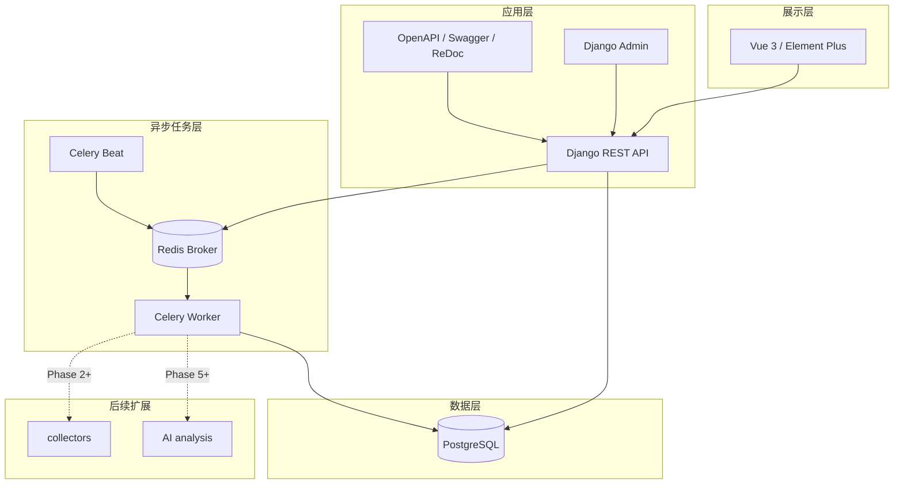
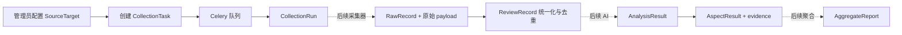

# 系统架构

## 总体架构

## 前后端职责

前端负责路由、状态展示、筛选、分页、表单与错误提示，不保存业务真相。后端负责校验、持久化、状态机、分页过滤、契约输出和管理入口。URL 由集中 API client 与环境变量管理。

## 采集层职责

`collectors/base` 定义目标校验、分页抓取、解析和标准化四步接口。Django 的 `collection` 应用只管理任务与运行状态，不包含京东或荣耀页面逻辑。每个来源实现独立适配器，通过统一 `NormalizedReview` 进入后端。

## AI 层职责

`ai` 维护输入输出 Schema、版本化 Prompt、示例和评估边界。Django `analysis` 应用存储模型/Prompt 版本和证据结果，不绑定特定供应商。Phase 1 不发起模型调用。

## 数据流

## Celery 任务流

1. API 创建 PENDING 任务，不假定执行成功。
2. Worker 锁定任务并切换到 RUNNING，创建递增的 CollectionRun。
3. 当前阶段抛出 `CollectorNotImplementedError`。
4. 异常路径原子写入任务和运行记录的 FAILED、完成时间、失败数与安全错误消息。
5. 后续采集器接入时复用状态机、checkpoint 和计数，不改变 API 主契约。

## 模块边界

- `common`：时间戳、分页、异常和健康检查。
- `products`：品牌、产品、别名、版本。
- `sources`：平台与具体入口，不保存任务状态。
- `collection`：任务、运行、checkpoint 和 Celery 入口。
- `reviews`：统一反馈与去重，不做 AI 推断。
- `analysis`：版本化分析结果与证据，不做报告聚合。
- `reports`：时间周期和报告快照。
- `collectors` / `ai`：可替换的领域实现层，不直接依赖前端。

## 失败处理

数据库/Redis 健康异常返回 `degraded`，不泄漏连接信息。DRF 已知异常统一为 `status/code/detail`。采集异常必须分类、可重试性明确并写入运行记录；不得吞掉异常或把部分失败报告为成功。前端集中提示 API 错误并保留页面级明确错误状态。

## 扩展方式

新增来源时实现 `BaseCollector`、新增来源配置和契约测试；新增模型供应商时实现 Schema 适配器并记录版本；新增统计时从 `AspectResult` 生成可重建快照。业务增长后可拆分 Worker 队列、只读 API、对象存储和独立分析服务，而无需改变统一反馈主模型。
